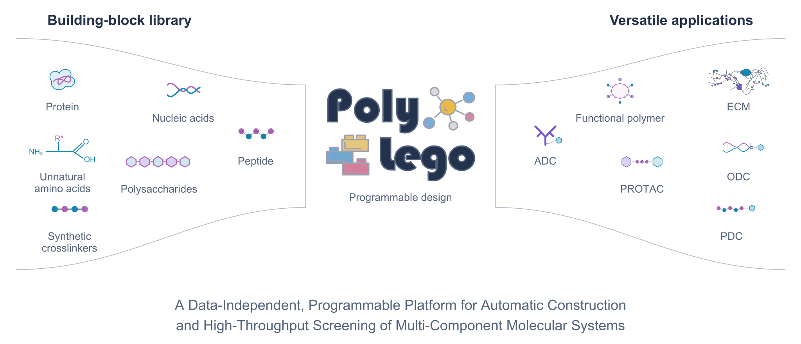

# PolyLego

Modular assembly and force-field parametrisation of polymers and PROTACs, with inputs
ready for MD simulation.

<picture>
  <source media="(prefers-color-scheme: dark)" srcset="assets/polylego-overview-dark.svg">
  
</picture>

## Contents

- [Overview](#overview)
- [Get Started](#get-started)
- [Examples](#examples)
- [System Requirements](#system-requirements)
- [Citation](#citation)
- [License](#license)
- [Contacts](#contacts)

## Overview

PolyLego builds complex molecules from reusable building blocks under rules you declare,
so that whole families of candidates can be enumerated rather than modelled one at a time.
Each assembly comes with a complete force field - transferred within the blocks, derived
across the new junctions - and is ready for MD simulation.

Four commands cover the workflow:

| Command | Purpose |
|---|---|
| `PolyLego-BuildPolymer` | assemble molecules from building blocks |
| `PolyLego-AssignForceField` | parametrise an assembly |
| `PolyLego-OptimizeBinding` | polymer-protein poses; PROTAC ternary-complex poses |
| `PolyLego-Analyze` | GROMACS simulation set-up, MM-PBSA and trajectory analysis |

PolyLego is distributed here as a compiled Python wheel, with worked examples and
documentation.

## Get Started

Create the environment, install the wheel from the [Releases](../../releases) page, and
run the first example:

```shell
# environment with GROMACS, AmberTools and RDKit
conda env create -f environment.yml
conda activate polylego

# install PolyLego
pip install PolyLego-1.4.0-cp310-cp310-linux_x86_64.whl

# assemble a small PEG-like polymer and parametrise it (about 3 minutes)
cd examples/01_polymer_PEG
bash run.sh
```

The second step prints:

```text
PolyLego 1.4.0 | AssignForceField
force field for B (polymer)
  building block pei: GAFF-2.11 + AM1-BCC charges
  building block ethandial: GAFF-2.11 + AM1-BCC charges
  junction parameters from capped fragments
  assembly topology
  vacuum energy minimisation + short NVT (GROMACS)
Finished in 2 min 48 s
  output/assembly.top
  output/assembly.gro
  output/assembly.pdb
```

`output/assembly.top` and `output/assembly.gro` go straight into `gmx grompp`.
Next, read [docs/TUTORIAL.md](docs/TUTORIAL.md), which explains the definition file, each
workflow, the environment variables and what the commands print;
[docs/CLI_MANUAL.md](docs/CLI_MANUAL.md) is the full option reference.

## Examples

Every example has an `input/` directory, a `run.sh`, and a Jupyter notebook with the same
steps plus 3D views. Details are in [examples/README.md](examples/README.md).

| Example | What it shows | Runtime |
|---|---|---|
| [01_polymer_PEG](examples/01_polymer_PEG) | assembly and parametrisation of a small polymer | ~3 min |
| [02_polymer_mNET](examples/02_polymer_mNET) | a polymer placed on a protein surface | ~2 min |
| [03_ADC_6p6d](examples/03_ADC_6p6d) | an antibody-drug conjugate: two drug-linkers on an IgG1 Fc (PDB 6P6D) | ~2 min |
| [04_ECM_5xau](examples/04_ECM_5xau) | a glycan (NAG) attached to a multi-chain protein (PDB 5XAU) | ~2 min |
| [05_PROTAC_dBET23_6BN7](examples/05_PROTAC_dBET23_6BN7) | a PROTAC assembled, parametrised and docked; scored against crystal 6BN7 | ~20 min |
| [06_PROTAC_validation_8G1P](examples/06_PROTAC_validation_8G1P) | a PROTAC docked from SMILES only; scored against crystal 8G1P | ~10 min |

Runtimes were measured with 8 threads.

## System Requirements

Tested on CentOS 7.7 (x86-64) with Intel Xeon Platinum 8260 CPUs and NVIDIA Tesla
V100-PCIE-32GB GPUs.

## Citation

If PolyLego contributed to work you publish, please cite the paper describing it
(manuscript in preparation):

> Juan Du<sup>#</sup>, Shiyu Wang<sup>#</sup>, Chuanxu Cheng<sup>#</sup>, Chenmeng Li,
> Yunzheng Lin, Yifei Gong, Dan Shao, Kam W. Leong, Zhiwei Cao<sup>\*</sup>,
> Zhi-Liang Ji<sup>\*</sup>. Enumeration-First Design of Multicomponent Molecular Systems,
> 2026.

<sup>#</sup> equal contribution &nbsp;&nbsp; <sup>\*</sup> corresponding authors

The "Cite this repository" button on GitHub uses [CITATION.cff](CITATION.cff).

## License

PolyLego is proprietary software, not open source. It may be used only for non-commercial
academic research and evaluation, under the terms in [LICENSE](LICENSE). Redistribution,
reverse engineering and commercial use are not permitted, and no patent rights are
granted. Patent applications are pending.

## Contacts

For questions, bug reports and licensing enquiries, write to
[appo@xmu.edu.cn](mailto:appo@xmu.edu.cn).
